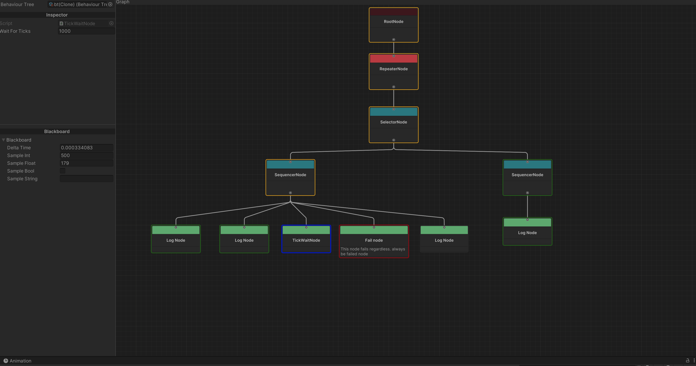

# MindWineBT



# 🧠 Behaviour Tree System for Unity 2022.3

A modular, extensible Behaviour Tree framework for game AI — designed for clarity, flexibility, and performance.

## 🎯 Features

- ✅ Node-based architecture (Selector, Sequence, Decorators, etc.)
- 🧩 Custom actions and conditions
- 🔁 Support for composite, decorator, and leaf nodes
- 📦 Serialized and runtime trees
- 🛠️ Editor-friendly
- 📄 Easy-to-read and debug

## 📚 Overview

Behaviour Trees are a structured way to create complex, reactive AI. 
This system allows developers to create intelligent agents by composing nodes like:

- **Composite Nodes**: `Sequence`, `Selector`
- **Decorator Nodes**: `Inverter`, `Repeater`, `Timeout`
- **Leaf Nodes**: `Action`, `Condition`

Example of a simple tree:
```
Selector
├── Sequence
│   ├── Condition: HasTarget
│   └── Action: MoveToTarget
└── Action: Patrol
```

## 🚀 Getting Started

### 🔧 Installation

Clone this repository:

```bash
git clone https://github.com/thilina27/MindWineBT
```

This includes a unity project with BT. If you only need the BT you can copy over only the `MindWineBehaviourTree` directory to your project.

### 🧱 Example Usage

Check sample scene.

## 📂 Structure

```
/Runtime
    /Tree       # BTree logic
    /Nodes      # Built-in composite, decorator, and leaf nodes
    /Samples    # sample trees
/Editor         # custom editor UI for Unity
```

## 📌 Roadmap

- [x] Visual editor for Unity
- [x] Blackboard system for shared data
- [ ] Add Unity 6 version
- [ ] Async node support

## 📄 License

MIT License — use freely in commercial and personal projects.

---

Made with ❤️ by [thilina27]
